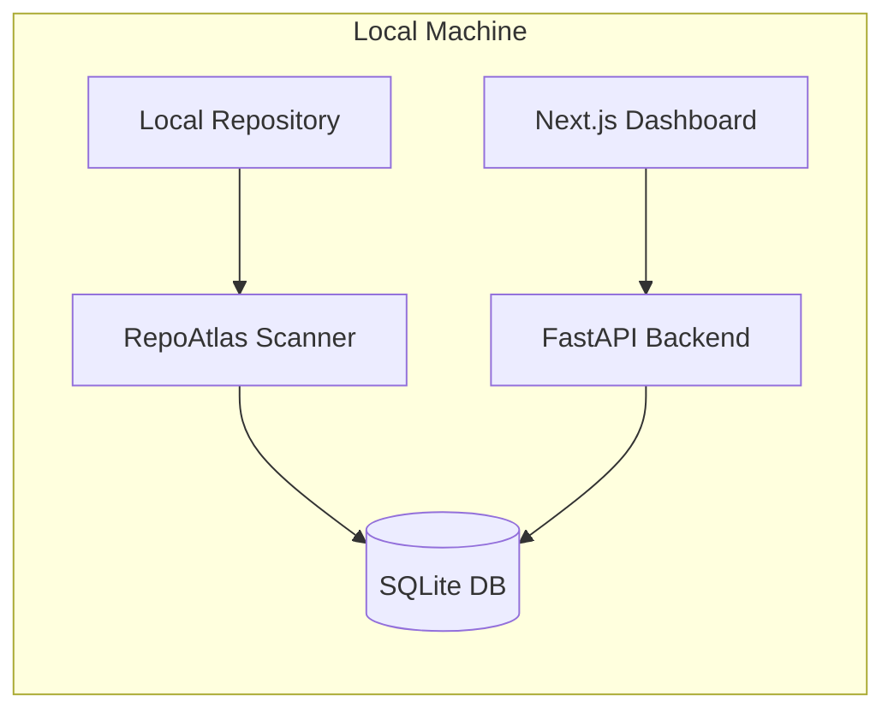

# RepoAtlas

**Local-first developer intelligence for unfamiliar codebases.**

RepoAtlas scans a repository on your machine and generates an interactive architecture map, dependency graph, API endpoint catalog, and risk hotspot analysis — without uploading a single byte of your code.

![RepoAtlas Dashboard]


> Screenshot placeholder — run `make dev` and capture your dashboard after scanning the demo repo.

---

## Why RepoAtlas?

Onboarding to a new codebase is slow. You grep for routes, trace imports manually, and guess which files are safe to change. RepoAtlas answers the questions engineers ask on day one:

- What are the **main modules** and how do they connect?
- Where are the **API entry points**?
- Which files have the highest **blast radius** if changed?
- Are there **circular dependencies**?
- Which files are **complex or risky**?

All analysis runs **locally**. Your source code never leaves your machine.

---

## Features

| Feature | Description |
|---------|-------------|
| **Repository Scanner** | Safely walks Python and JS/TS files, ignoring build artifacts |
| **Dependency Graph** | Interactive visualization with React Flow |
| **API Discovery** | Detects FastAPI, Flask, and Express routes |
| **Risk Hotspots** | Composite 0–100 risk score with plain-English explanations |
| **Circular Dependency Detection** | Highlights import cycles |
| **Blast Radius** | Transitive dependent count per file |
| **Demo Mode** | Built-in synthetic repo for instant exploration |
| **SQLite Persistence** | Scan results saved locally, no external DB |

---

## Architecture



See [docs/ARCHITECTURE.md](docs/ARCHITECTURE.md) for detailed module boundaries.

---

## Tech Stack

| Component | Technology |
|-----------|------------|
| Backend | Python 3.10+, FastAPI, SQLAlchemy |
| Frontend | Next.js 14, TypeScript, Tailwind CSS |
| Graph | React Flow (@xyflow/react) |
| Data | TanStack Query, SQLite |
| Parsing | Python AST, regex-based JS/TS |
| DevOps | Docker Compose, Makefile |

---

## Quick Start

### Prerequisites

- Python 3.10+
- Node.js 20+
- Make (optional but recommended)

### Setup

```bash
git clone <your-repo-url> repo-atlas
cd repo-atlas
cp .env.example .env
make install
make dev
```

Open **http://localhost:3000** and click **Run Demo**.

### Manual Start

```bash
# Terminal 1 — Backend (from repo-atlas root)
cd backend && python3 -m venv .venv && source .venv/bin/activate
pip install -e ".[dev]"
cd .. && PYTHONPATH=backend uvicorn app.main:app --reload --port 8000

# Terminal 2 — Frontend
cd frontend && npm install && npm run dev
```

---

## Demo

A synthetic multi-language repository lives at `demo/sample-repo/`:

- FastAPI service with user/order endpoints
- Express service with product endpoints
- Shared Python modules with an intentional circular dependency

```bash
make demo   # Requires backend running
```

See [docs/DEMO.md](docs/DEMO.md) for details.

---

## API Overview

| Method | Endpoint | Description |
|--------|----------|-------------|
| GET | `/health` | Health check |
| POST | `/api/projects/scan` | Scan a local repository |
| GET | `/api/projects` | List projects |
| GET | `/api/projects/{id}` | Project details |
| GET | `/api/projects/{id}/graph` | Dependency graph |
| GET | `/api/projects/{id}/files` | File listing |
| GET | `/api/projects/{id}/endpoints` | API endpoints |
| GET | `/api/projects/{id}/hotspots` | Risk hotspots |

Full reference: [docs/API.md](docs/API.md)  
Interactive docs: http://localhost:8000/docs

---

## Testing

```bash
make test
```

Or individually:

```bash
# Backend
cd backend && source .venv/bin/activate && pytest -v

# Frontend
cd frontend && npm test
```

---

## Docker

```bash
docker compose up --build
```

Backend: http://localhost:8000  
Frontend: http://localhost:3000

---

## Security & Privacy

RepoAtlas is **local-first by design**:

- Scans only the directory path you provide
- Never uploads source code to external services
- Stores results in a local SQLite database
- Does not require network access after installation
- Safe to use on proprietary codebases (all data stays on your machine)

---

## Roadmap

See [docs/ROADMAP.md](docs/ROADMAP.md) for planned features including additional language support, git churn analysis, and export capabilities.

---

## Contributing

Contributions welcome! See [docs/CONTRIBUTING.md](docs/CONTRIBUTING.md).

---

## License

MIT — see [LICENSE](LICENSE).
