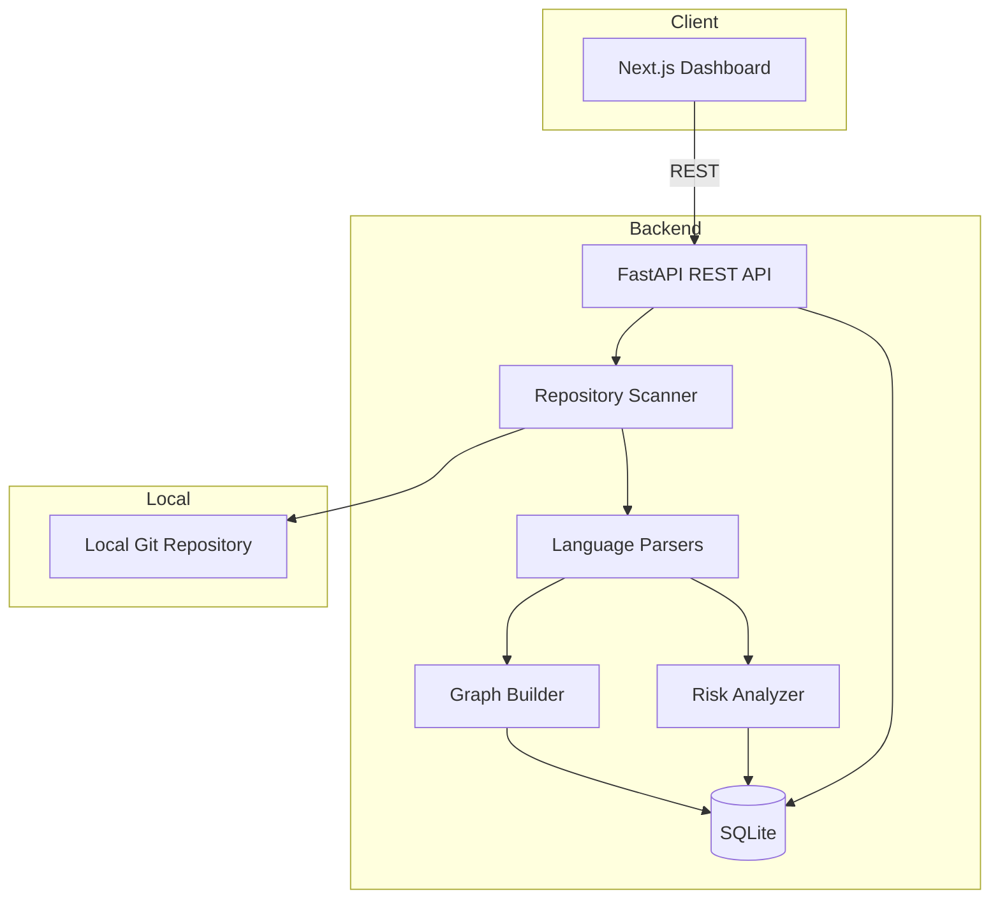

# RepoAtlas Architecture

## Overview

RepoAtlas is a local-first developer intelligence platform. It scans repositories on disk, extracts structural metadata, and persists results in SQLite for interactive exploration via a Next.js dashboard.

## Module Boundaries

### `app/services/scanner/`
Walks the filesystem safely within a user-provided root path. Ignores common build/cache directories. Delegates parsing to language-specific modules.

### `app/services/parsers/`
- **python_parser.py** — AST-based import/symbol/endpoint extraction
- **js_parser.py** — Regex-based import/symbol/endpoint extraction for JS/TS

### `app/services/graph/`
Builds dependency edges, detects circular dependencies, and computes blast-radius scores via transitive inbound reachability.

### `app/services/analyzers/`
Computes composite risk scores (0–100) from LOC, imports, dependents, complexity, and blast radius.

### `app/services/metrics/`
Cyclomatic complexity approximation and symbol counting utilities.

### `app/db/` & `app/models/`
SQLAlchemy models and session management. Tables: `projects`, `scan_runs`, `files`, `dependencies`, `endpoints`, `metrics`.

### `frontend/`
Next.js App Router UI with TanStack Query for data fetching and React Flow for graph visualization.

## Data Flow

1. User submits a local path via `POST /api/projects/scan`
2. Scanner walks repo, parses supported files (`.py`, `.js`, `.ts`, `.tsx`)
3. Import statements resolved to internal file paths where possible
4. Results persisted to SQLite; graph and metrics computed
5. Frontend fetches project detail, graph, endpoints, and hotspots

## Security Model

- Scanning is constrained to the resolved absolute path of the user-provided directory
- No network calls transmit source code
- No external database or cloud services required for MVP

## Technology Choices

| Layer | Choice | Rationale |
|-------|--------|-----------|
| Backend | FastAPI | Async-ready, OpenAPI docs, type hints |
| Storage | SQLite | Zero-config local persistence |
| Python parsing | AST | Deterministic, stdlib, no extra deps |
| JS/TS parsing | Regex | Practical MVP without bundling tree-sitter |
| Frontend | Next.js 14 | App Router, SSR-capable, portfolio-ready |
| Graph UI | React Flow | Interactive node-edge visualization |
